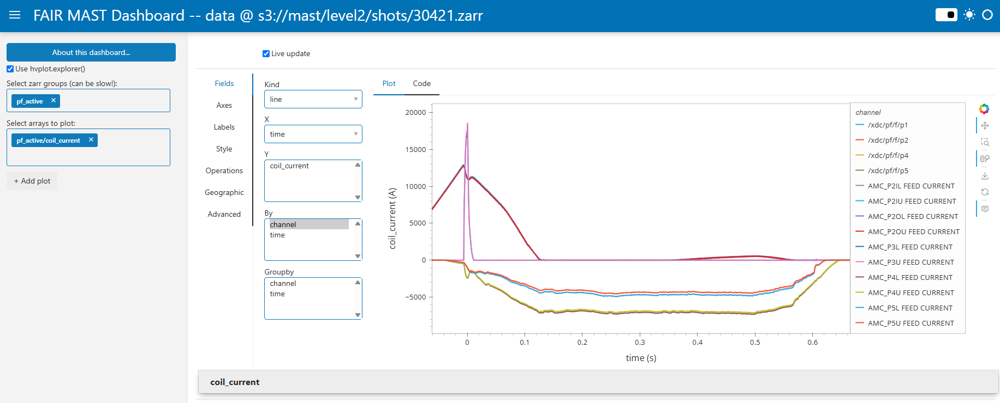

# FAIR-MAST-Dashboard
Simple dashboard for visualizing [FAIR-MAST datasets](mastapp.site).



## How to run
1.  Clone the repository
```bash
git clone https://github.com/maarten-ic/FAIR-MAST-Dashboard.git
cd FAIR-MAST-Dashboard
```
2. Setup a virtual environment and install dependencies
```bash
python -m venv venv
. venv/bin/activate
pip install s3fs 'zarr < 3' panel watchfiles holoviews hvplot xarray
```
3. Start a Panel server to view the dashboard (use Ctrl+C to shut down the application)
```bash
panel serve --dev --show fair-mast-panel.py
```


# Notice
This dashboard is available under the [LGPL-3.0
license](https://www.gnu.org/licenses/lgpl-3.0.en.html).

Copyright 2025, Ignition Computing B.V.
